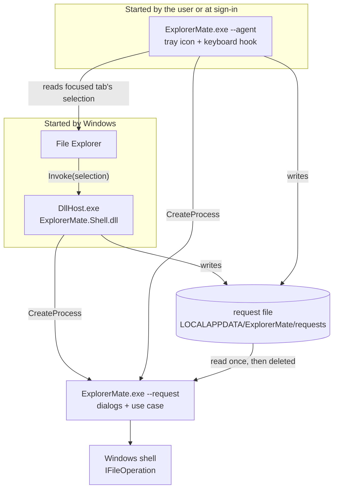
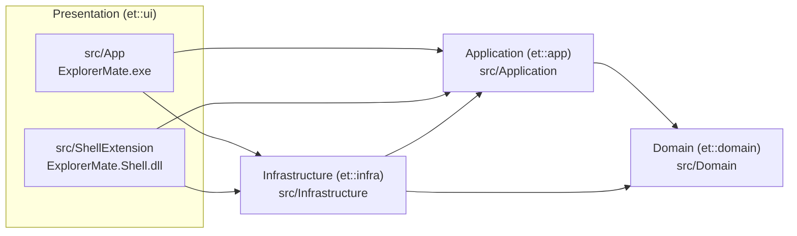
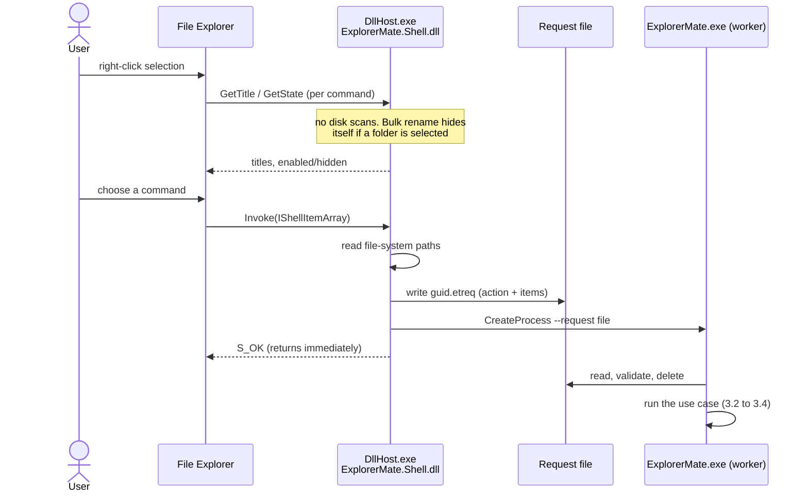
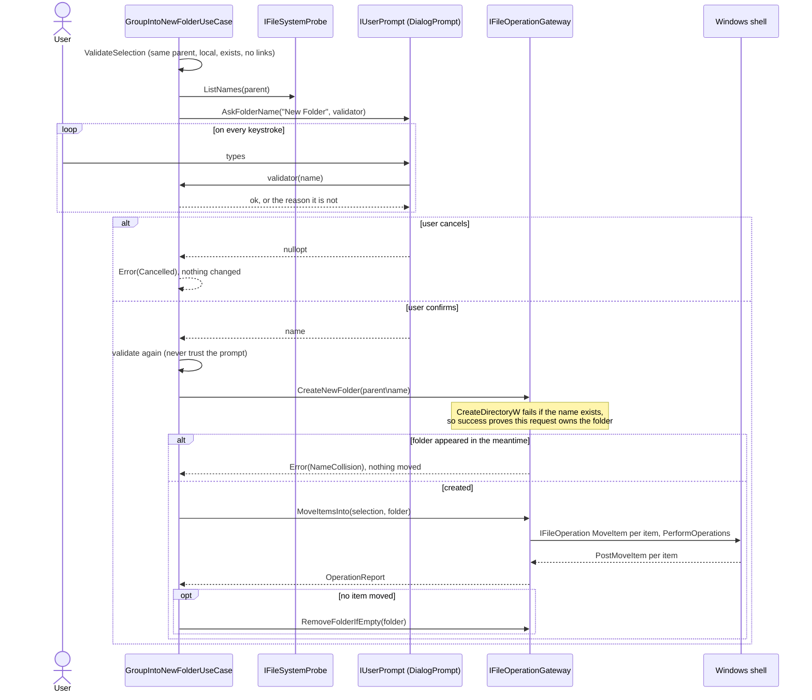
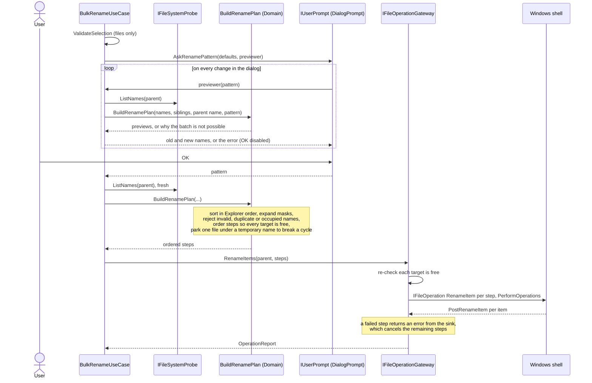
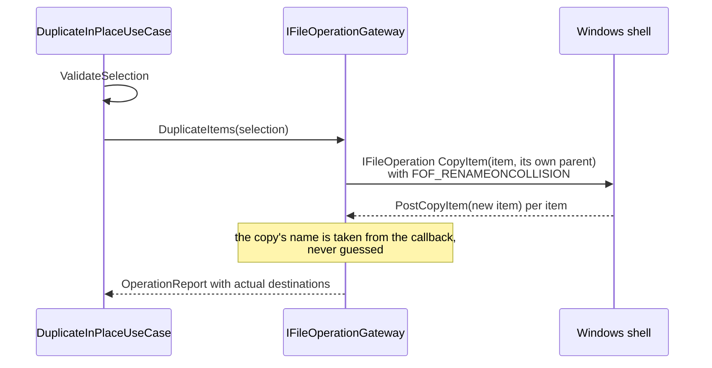
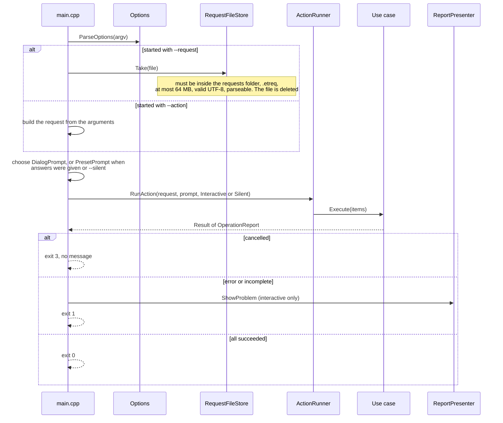
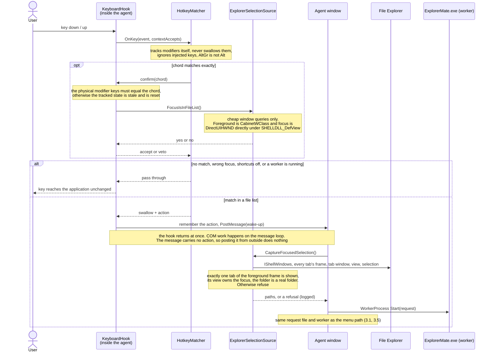

# Explorer Mate — Architecture

What the product must do is in `docs/SRS.md`; this document explains how the code is organised to do it. Diagrams use Mermaid and render on GitHub.

## 1. Overview

Explorer Mate ships two files that play three roles:

| Binary | Role | Runs in |
|---|---|---|
| `ExplorerMate.Shell.dll` | Context-menu commands (`IExplorerCommand`). Hands the selection to a worker and returns. | `DllHost.exe` (COM surrogate with package identity) |
| `ExplorerMate.exe --request <file>` | **Worker**: dialogs and file operations for one command. | Its own short-lived process |
| `ExplorerMate.exe --agent` | **Agent**: tray icon, keyboard hook, settings. Hands the selection to a worker. | One long-lived process per session |

The same EXE also has a direct command line (`--action …`), an introduction window (no arguments) and diagnostics.

Design consequences:

- Nothing slow or interactive runs inside a process Windows owns. A crash in a worker cannot take Explorer down.
- The menu path and the shortcut path converge on the same worker, so a command behaves identically however it was invoked.
- The agent never touches files itself.

## 2. Layers

Dependencies point inward only. `scripts/check-layers.ps1` scans `#include` lines and fails the test run when an inner layer includes a Windows header or an outer layer.

| Layer | May include | Contains |
|---|---|---|
| Domain | C++ standard library | Value objects and pure rules |
| Application | Domain | Use cases, ports (interfaces), request/settings formats, hotkey matching |
| Infrastructure | Application, Domain, Windows SDK | Adapters that implement the ports with Win32/COM |
| Presentation | Everything | Composition roots, dialogs, command line, COM command classes |

### 2.1 Domain (`src/Domain`)

| File | Responsibility |
|---|---|
| `Result.h`, `Error.h` | `Result<T>` / `Status` for returning errors without exceptions |
| `PathText` | Text-only helpers for drive-absolute paths |
| `ItemName` | Splitting name/extension; Windows naming rules |
| `FolderName`, `Selection` | Validated value objects |
| `NameCollation` | `INameCollation`: what "same name" and "Explorer order" mean; a portable `SimpleNameCollation` |
| `RenameMask` | Mask expansion (`[N]`, `[E]`, `[C]`, `[P]`, ranges, literal brackets) |
| `RenamePlan` | Computes a whole rename batch: numbering, collision checks, step ordering, cycle breaking |
| `OperationReport` | Per-item outcome of a batch |
| `KeyChord` | Parsing, formatting and validating shortcuts |
| `ProductInfo` | Display name, short name, version, author, website |

### 2.2 Application (`src/Application`)

Use cases, each with one `Execute(paths)` method returning `Result<OperationReport>`:

- `GroupIntoNewFolderUseCase`
- `BulkRenameUseCase`
- `DuplicateInPlaceUseCase`

Shared: `SelectionGuard` (the common precondition), `ActionKind`, `ActionRequest` (request format), `Settings`, `HotkeyMatcher`.

Ports and their adapters:

| Port | Responsibility | Production adapter | Test double |
|---|---|---|---|
| `IFileSystemProbe` | Read-only questions about the file system | `Win32FileSystemProbe` | `FakeFileSystem` |
| `IFileOperationGateway` | Everything that changes the file system; never overwrites | `ShellFileOperationGateway` | `FakeFileSystem` |
| `IUserPrompt` | Questions only the user can answer | `DialogPrompt`, `PresetPrompt` | `ScriptedPrompt` |
| `ISelectionSource` | The selection of the focused Explorer tab | `ExplorerSelectionSource` | — |
| `ILogger` | Diagnostics | `FileLogger` | — |
| `INameCollation` (Domain) | Name equality and display order | `WindowsNameCollation` | `SimpleNameCollation`, `ReversedCollation` |

### 2.3 Infrastructure (`src/Infrastructure`)

| File | Responsibility |
|---|---|
| `ShellFileOperationGateway` | `IFileOperation` + progress sink; per-item results; pre-checks rename targets |
| `Win32FileSystemProbe`, `WindowsNameCollation` | File attributes, listings; `CompareStringOrdinal`, `StrCmpLogicalW` |
| `ShellSelection` | `IShellItemArray` → file-system paths |
| `RequestFileStore`, `WorkerProcess` | Writing/taking request files; starting a worker |
| `ExplorerWindows`, `ExplorerSelectionSource` | Enumerating Explorer tabs; deciding which one a shortcut applies to |
| `KeyboardHook` | `WH_KEYBOARD_LL` wrapper |
| `SettingsFile`, `Autostart`, `AppDataPaths`, `FileLogger` | Persistence and logging |
| `ComApartment`, `ErrorText`, `Utf8` | COM lifetime, error messages, encoding |

### 2.4 Presentation

`src/App` (EXE): `main.cpp` and `Options` (command line), `ActionRunner` (composition root for one request), `DialogPrompt`, `PresetPrompt`, `ReportPresenter`, `Agent`, `SettingsDialog`, `AboutDialog`, `ChangelogDialog` (shows `CHANGELOG.md`, embedded as a resource), `ExplorerDiagnostics`, `App.rc`.

`src/ShellExtension` (DLL): `ExplorerCommandBase` (shared `IExplorerCommand` plumbing), `Commands.cpp` (the three command classes and their CLSIDs), `WorkerLauncher`, `ShellLog`.

## 3. Sequence diagrams

### 3.1 Any command from the context menu

### 3.2 New folder with selection

### 3.3 Bulk rename

### 3.4 Duplicate

### 3.5 What the worker does around a use case

### 3.6 A command from a keyboard shortcut

### 3.7 Agent lifetime and settings

```mermaid
sequenceDiagram
    actor User
    participant Agent
    participant File as SettingsFile
    participant Dialog as SettingsDialog

    User->>Agent: start (--agent, or at sign-in)
    Agent->>Agent: take the single-instance mutex
    alt another agent already runs
        Agent-->>User: exit quietly
    else first agent
        Agent->>File: Load()
        Note over File: missing file gives defaults. Unreadable file gives<br/>defaults for this session and is left untouched
        Agent->>Agent: tray icon, keyboard hook, session notifications
    end
    User->>Agent: tray, Settings...
    Agent->>Dialog: EditSettings(current)
    Dialog->>Dialog: ValidateSettings on OK (chord rules, no duplicates)
    Dialog-->>Agent: new settings, or cancelled
    Agent->>File: Save() (write temp file, then rename)
    Agent->>Agent: rebuild HotkeyMatcher
    User->>Agent: tray Exit, or --stop-agent
    Agent->>Agent: remove hook and tray icon, quit
```

## 4. Data-safety rules

- **Never overwrite, never merge.** Copies use `FOF_RENAMEONCOLLISION`. Moves only go into a folder the same request created. Renames are rejected by the planner when a target is taken by an item outside the batch, and the gateway re-checks every target immediately before handing it to the shell.
- **`FOF_NOCONFIRMATION` is never used.** It would answer "yes" to overwrite prompts. `FOF_SILENT | FOF_NOERRORUI` does not suppress the shell's "Replace or Skip" dialog, which is why the gateway pre-checks.
- **No rollback.** `IFileOperation` is not transactional; a partial result is reported per item. The only cleanup is `RemoveDirectoryW` on the folder a group command just created, which can only remove an empty folder.
- **Requests are untrusted.** The worker accepts a request file only from its own folder, validates format and size, and the use case re-validates the selection against the disk.
- **No shell interpreter.** The selection travels in a file; the command line carries only the path of a GUID-named request file.

## 5. COM and threading

- The DLL uses WRL `RuntimeClass<ClassicCom, IExplorerCommand>`, `ThreadingModel=STA`.
- The worker and the agent each run a single STA (`ComApartment`, RAII) on their main thread. `IFileOperation::PerformOperations` pumps messages itself.
- `Invoke` and the progress sink wrap their bodies in `try/catch`; no exception crosses a COM boundary.
- Actual destinations come from `IFileOperationProgressSink::Post*Item`. Returning an error from `PostRenameItem` cancels the operations still queued.
- The keyboard hook runs on the agent's main thread and only calls `HotkeyMatcher` and a few `user32` functions.

## 6. Packaging

| Manifest | Used for | Notes |
|---|---|---|
| `packaging/AppxManifest.xml` | Development: sparse package `ExplorerMate.Dev` pointing at `build\install` | Needs `unvirtualizedResources` + `FileSystemWriteVirtualization=disabled`, otherwise the DLL's `%LOCALAPPDATA%` is redirected into the package and the worker cannot find the request file |
| `packaging/release/AppxManifest.xml` | Release: full MSIX `ExplorerMate` with the binaries inside | Only `runFullTrust`; has a Start menu entry |

The two packages register the same commands, so the install scripts refuse to register one while the other is present.

## 7. Decisions

### ADR-1: Package identity through a sparse package, registered with Developer Mode

- **Context:** the Windows 11 context menu only accepts `IExplorerCommand` from apps with package identity.
- **Decision:** Win32 binaries plus a package with external location, registered unsigned via `Add-AppxPackage -Register … -ExternalLocation` under Developer Mode.
- **Consequence:** no certificate needed on a development machine. Distribution requires a signed package.

### ADR-2: Request file instead of a named pipe

- **Context:** the menu path has no resident process to talk to.
- **Decision:** the caller writes a `.etreq` file and starts a worker. The format is line-based text because Windows file names cannot contain line breaks, so no JSON parser is needed.
- **Consequence:** no IPC server or pipe ACLs. The agent reuses the same mechanism; nothing needs queueing because shortcuts are not intercepted while a worker runs.

### ADR-3: Silent mode writes no undo records

- **Decision:** `OperationUi::Silent` (tests, scripts) omits `FOF_ALLOWUNDO | FOFX_ADDUNDORECORD`; `Interactive` (menu, shortcuts) sets them.
- **Reason:** test operations must not end up in Explorer's Ctrl+Z stack.

### ADR-4: Identify the focused tab from window structure, and refuse when unsure

- **Context:** several tabs share one frame window; the frame handle does not identify a tab.
- **Decision:** the shown tab is the first `ShellTabWindowClass` child of the frame; the focus must be a `DirectUIHWND` directly under that tab's `SHELLDLL_DefView`. Verified with three tabs in one frame, two of them on the same folder with different selections.
- **Consequence:** depends on Explorer's window class names; if a Windows update changes them, shortcuts stop working rather than act on the wrong files.

### ADR-5: Version resources only in builds meant to be signed

- **Context:** Smart App Control on the development machine blocked some unsigned builds, unpredictably from one build to the next.
- **Decision:** the `VERSIONINFO` blocks are compiled only with `build.ps1 -EmbedVersionInfo`.
- **Consequence:** in development builds Task Manager shows `ExplorerMate.exe` rather than "Explorer Mate". Whether the resources influence the verdict is not established.

## 8. Known weak points

- A program running as the same user can do anything the user can, including driving Explorer Mate's command line. The agent does not add to that: its internal "shortcut pressed" message carries no action (the action is kept in the agent after a real key press), so posting it from outside does nothing.
- The tracked modifier state can go stale behind a UAC prompt or an elevated window. A matched chord is therefore confirmed against the physical keyboard state (`PhysicalModifiersMatch`) before it is accepted.
- If a rename batch that needed a temporary name (a cycle) fails half-way, one file is left named `~explorermate-N.tmp`. The report lists the failed step, but does not yet say which original name that file had.
- Junctions inside a folder being duplicated are followed by the shell's copy engine; only the selected items themselves are checked for links.
- `BringToFront` attaches to the foreground thread's input queue for a moment; if that thread is hung, the worker's dialog waits with it.
- In a full MSIX install the autostart Run key will be virtualised; a package startup task is needed.
- Data-folder consistency between DLL, worker and agent has been checked for the sparse package and a loosely registered full package, not for a signed `.msix` install.
