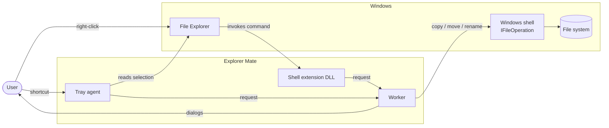

# Explorer Mate — Software Requirements Specification

Version 0.1.0 · applies to the `main` branch.

Requirement IDs (`FR-…`, `NFR-…`) are stable; tests and design notes refer to them. The "Verified by" column names where each requirement is checked: a test class under `tests/`, a script under `scripts/`, or "manual" (see `docs/TEST_MATRIX.md` for what has actually been run).

## 1. Introduction

### 1.1 Purpose

Explorer Mate adds a small set of file commands to the Windows 11 File Explorer. This document states what the product must do and the constraints it must respect. How it does so is described in `docs/ARCHITECTURE.md`.

### 1.2 Scope

In scope:

- Three commands on a selection of items in File Explorer: **New folder with selection**, **Bulk rename**, **Duplicate**.
- Two ways to invoke them: the Windows 11 context menu and keyboard shortcuts.
- A tray agent with settings for the shortcuts.
- A command line for the same commands.

Out of scope: replacing File Explorer, file management beyond the three commands, network or cloud features, telemetry, Windows 10. Windows on ARM is not supported: there is no ARM64 build and no ARM device to test on; community help is wanted (see the README).

### 1.3 Definitions

| Term | Meaning |
|---|---|
| Selection | The items the user has selected in one Explorer tab. All must be in the same folder. |
| Parent | The folder that contains the selection. |
| Worker | `ExplorerMate.exe` started to carry out one command. |
| Agent | `ExplorerMate.exe --agent`, the tray process that provides keyboard shortcuts. |
| Shell extension | `ExplorerMate.Shell.dll`, which provides the context-menu commands. |
| Request | The hand-over from the shell extension or the agent to a worker: one command plus item paths. |
| Mask | A rename template such as `[N]_[C]`. |
| Chord | A keyboard shortcut: modifiers plus one key, e.g. Ctrl+Alt+N. |

### 1.4 Users

A single Windows user working in File Explorer. No administrator rights are required for any command. Developers building from source are a second audience; see the README.

## 2. Overall description

### 2.1 Product perspective

Explorer Mate is an add-on, not an application the user works inside. Its only windows are short-lived dialogs (folder name, rename options, settings, introduction, error report) and a tray icon.

### 2.2 Operating environment

- Windows 11 x64, build 22000 or later.
- NTFS or another local file system reachable through a drive letter.
- The context-menu commands require package identity: a registered MSIX or sparse package.

### 2.3 Constraints

- C++20, native Win32 and COM; no .NET, Electron or scripting runtime at run time.
- No administrator rights, no Windows service, no kernel driver.
- File operations go through the Windows shell (`IFileOperation`).
- Unsigned builds can only be registered with Developer Mode on, and may be refused by Smart App Control.

### 2.4 Assumptions

- The user understands that shell operations are not transactions: a batch interrupted half-way stays half done.
- Shortcuts are only expected to work while the agent is running.

## 3. Functional requirements

### 3.1 Common to all commands

| ID | Requirement | Verified by |
|---|---|---|
| FR-C1 | A command acts on a non-empty selection whose items all share one parent folder. Otherwise it does nothing and says why. | `SelectionTests` |
| FR-C2 | Items must be on a local drive-letter path. UNC paths and virtual locations (Recycle Bin, ZIP contents, search results, devices) are refused with a message. | `SelectionTests`, `PathTextTests` |
| FR-C3 | Symbolic links, junctions and online-only cloud files are refused with a message. | `SelectionTests` (links); cloud files by design only |
| FR-C4 | Every item must still exist when the command starts; otherwise the command is refused before anything changes. | `SelectionTests`, `GroupIntoNewFolderTests` |
| FR-C5 | No command overwrites an existing item or merges into an existing folder. | `ShellGatewayTests`, `DuplicateInPlaceTests` |
| FR-C6 | Cancelling a dialog changes nothing and shows no error. | `GroupIntoNewFolderTests`, `BulkRenameTests` |
| FR-C7 | When a batch ends incomplete, the user is told which items failed or were skipped and why. Items never attempted are counted. | manual; `ReportPresenter` |
| FR-C8 | The outcome of each item is reported separately as succeeded, failed, skipped or not attempted. | `ShellGatewayTests` |
| FR-C9 | A path is accepted only if its text names exactly one item: no `.` or `..` components, no trailing dot or space, no control characters, no `:` (alternate data streams). | `PathTextTests` |
| FR-C10 | At most 5,000 items per command; more is refused with a message. | design |
| FR-C11 | A command that cannot start (unsupported location, too many items, unreadable request) tells the user why instead of silently doing nothing. | design |

### 3.2 New folder with selection

| ID | Requirement | Verified by |
|---|---|---|
| FR-G1 | Ask for a folder name, pre-filled with `New Folder`, or `New Folder (2)`, `(3)`… when that name is taken. | `GroupIntoNewFolderTests` |
| FR-G2 | Validate the name as the user types: not empty, no `\ / : * ? " < > |`, no control characters, no trailing dot or space, no leading space, not a reserved device name (`CON`, `NUL`, `COM1`…), at most 255 characters, not already used in the parent. OK is disabled while invalid. | `ItemNameTests`, `scripts/probe-dialog.ps1` |
| FR-G3 | Create the folder in the parent, then move the selection into it, keeping each item's subtree intact. | `ShellGatewayTests` |
| FR-G4 | Items are only moved into a folder this command created. If something with that name appears between validation and creation, nothing is moved. | `GroupIntoNewFolderTests` |
| FR-G5 | If no item could be moved, the empty folder is removed. A folder that contains anything is never deleted. | `GroupIntoNewFolderTests`, `ShellGatewayTests` |

### 3.3 Bulk rename

| ID | Requirement | Verified by |
|---|---|---|
| FR-R1 | Applies to files only. A selection containing a folder is refused; the menu command is hidden for it. | `BulkRenameTests`, `scripts/probe-command.ps1` |
| FR-R2 | New name = expanded name mask + `.` + expanded extension mask, then search-and-replace. An empty extension result means no dot. Defaults: `[N]_[C]` and `[E]`. | `RenamePlanTests` |
| FR-R3 | Placeholders: `[N]` name, `[E]` extension, `[C]` counter, `[P]` parent folder name, ranges `[N2-5]`, `[N2-]`, `[N2]`, `[N2,3]` (also for `E` and `P`), literal brackets `[[]` and `[]]`. Positions are 1-based; ranges past the end are clipped. | `RenameMaskTests` |
| FR-R4 | An unknown placeholder, an unclosed bracket or an empty resulting name is an error, shown before OK can be pressed. | `RenameMaskTests`, `RenamePlanTests` |
| FR-R5 | The counter has a start value, a step and a minimum number of digits (defaults 1, 1, 2). Its width grows so all counters in the batch have equal width. | `RenamePlanTests` |
| FR-R6 | Files are numbered in the order File Explorer sorts names (`IMG_7` before `IMG_12`), not in selection order. | `RenamePlanTests`, `ShellGatewayTests` |
| FR-R7 | Search-and-replace is case-sensitive and replaces every occurrence in the full new name. | `RenamePlanTests` |
| FR-R8 | The extension is the text after the last dot. A leading dot is not a separator (`.gitignore` has no extension). | `ItemNameTests` |
| FR-R9 | The dialog previews every old and new name and updates on each change. | `scripts/probe-dialog.ps1` |
| FR-R10 | The whole batch is validated before the first rename: a new name that is invalid, duplicated within the batch, or already used by an item outside the selection rejects the batch. | `RenamePlanTests`, `BulkRenameTests` |
| FR-R11 | When new names overlap current names of other selected files, renames run in an order that keeps every target free; cycles are broken through a temporary name. | `RenamePlanTests`, `ShellGatewayTests` |
| FR-R12 | The first failing rename stops the batch; the remaining steps are reported as not attempted. | `ShellGatewayTests` |

### 3.4 Duplicate

| ID | Requirement | Verified by |
|---|---|---|
| FR-D1 | Copy each selected file or folder into its own parent; folders are copied with all contents. | `ShellGatewayTests` |
| FR-D2 | The copy's name is chosen by Windows (for example `a - Copy.txt`) and is reported back as the actual destination. | `ShellGatewayTests` |
| FR-D3 | Repeating the command produces a further copy with a new name. | `ShellGatewayTests`, `DuplicateInPlaceTests` |
| FR-D4 | The clipboard is not used or changed. | design |

### 3.5 Context menu

| ID | Requirement | Verified by |
|---|---|---|
| FR-M1 | The three commands appear in the main Windows 11 context menu for files and folders. | manual |
| FR-M2 | Building the menu never scans folders or blocks; at most 256 items are inspected to decide visibility. | design |
| FR-M3 | The selection comes from what Explorer passes to the command, not from inspecting windows. | design |
| FR-M4 | Dialogs and file operations never run inside the shell host process. | design; `docs/ARCHITECTURE.md` |

### 3.6 Keyboard shortcuts

| ID | Requirement | Verified by |
|---|---|---|
| FR-K1 | Defaults: Ctrl+Alt+N (new folder), Ctrl+Alt+R (bulk rename), Ctrl+Alt+D (duplicate). Ctrl+D is not used because Explorer uses it for Delete. | `SettingsTests` |
| FR-K2 | A shortcut acts only when the foreground window is File Explorer and the keyboard focus is in the file list of the tab being shown. In a rename box, the search box, the address bar, the navigation pane or another application, the key passes through unchanged. | `scripts/test-tab-detection.ps1` (file list, rename box); others manual |
| FR-K3 | With several tabs or windows open, the selection of the focused tab is used. If that tab cannot be identified with certainty, the shortcut does nothing. | `scripts/test-tab-detection.ps1` |
| FR-K4 | A chord matches only with exactly its modifiers held. Right Alt (AltGr) never counts as Alt. | `HotkeyMatcherTests` |
| FR-K5 | Holding the keys does not repeat the command. | `HotkeyMatcherTests` |
| FR-K6 | Modifier keys are never swallowed; the matching key-up of a swallowed key is swallowed too. | `HotkeyMatcherTests` |
| FR-K7 | Key presses synthesised by other software are ignored. | `HotkeyMatcherTests` |
| FR-K8 | While a worker started by a shortcut is still running, further shortcuts are not intercepted. | design |
| FR-K9 | Before a shortcut fires, its modifiers are confirmed against the physical keyboard state; if the tracked state disagrees (key-ups missed behind a UAC prompt or an elevated window) the key passes through and the tracked state is reset. | `HotkeyMatcherTests` (veto path); physical check manual |
| FR-K10 | Only a real key press can start a command through the agent: messages posted to the agent by other programs carry no action. | design |

### 3.7 Tray agent and settings

| ID | Requirement | Verified by |
|---|---|---|
| FR-A1 | One agent per user session; a second one exits immediately. | manual (`--agent` twice) |
| FR-A2 | The tray menu offers: enable/disable shortcuts, Settings, Start with Windows, About, Exit. | manual |
| FR-A3 | Each command's chord can be changed or cleared. A chord must include Ctrl, Alt or Win and use a letter, a digit or F1–F24. Two commands cannot share a chord. | `KeyChordTests`, `SettingsTests` |
| FR-A4 | Settings persist across restarts. An unreadable settings file is left untouched and defaults are used for the session. | `SettingsTests`; design |
| FR-A5 | "Start with Windows" is off by default. | manual |
| FR-A6 | `--stop-agent` asks the running agent to exit. | manual |

### 3.8 Introduction window

| ID | Requirement | Verified by |
|---|---|---|
| FR-I1 | Starting the program with no arguments, `--about`, or "About…" in the tray menu shows the product name and version, a short description, the author, and links to the author's website, the source repository and its issue tracker. | manual; scripted read-back |
| FR-C5 | The installed package provides the command `explorermate` in any terminal. The terminal waits for it and shows its output. `--help` prints the command line. Item paths may be relative to the current folder; a trailing backslash is ignored. | scripted on a fixture; console screenshot |
| FR-I2 | "What's new" in the introduction window or in the tray menu, or `--changelog`, shows the changelog that was embedded in the program at build time. | manual; screenshot |
| FR-I3 | "Licenses" in the introduction window, or `--licenses`, shows the program's own license followed by the third-party notices, both embedded at build time. The same two files are shipped in the package. | manual; screenshot |
| FR-I2 | The link opens the website in the default browser. | manual |

### 3.9 Command line

| ID | Requirement | Verified by |
|---|---|---|
| FR-L1 | `--action <group\|rename\|duplicate> <item>…` runs a command on the given paths. | manual smoke tests |
| FR-L2 | `--name`, `--mask`, `--ext-mask`, `--start`, `--step`, `--digits`, `--search`, `--replace` answer the dialogs up front. | manual smoke tests |
| FR-L3 | `--silent` suppresses shell UI and undo records. | `ShellGatewayTests` (silent mode) |
| FR-L4 | Exit codes: 0 all done, 1 error or incomplete, 2 usage error, 3 cancelled. | manual smoke tests |
| FR-L5 | `--version`, `--diagnose-explorer [--delay n \| --watch n]` are available for support. | manual |

## 4. Non-functional requirements

| ID | Requirement | Verified by |
|---|---|---|
| NFR-S1 | **Data safety.** No user data is deleted. The only deletion is removing an empty folder the command itself created. No automatic rollback. | design; `ShellGatewayTests` |
| NFR-S2 | **Robustness of the host.** A failure in Explorer Mate must not crash or hang File Explorer. No exception crosses a COM boundary. | design |
| NFR-S3 | **Untrusted input.** A request file is accepted only from the product's request folder, with the expected extension, bounded size, valid UTF-8 and the expected format; its contents are validated again against the file system. | `RequestFileStoreTests`, `ActionRequestTests` |
| NFR-S4 | **No command shell.** Item paths are never passed through `cmd.exe` or PowerShell, nor placed on a command line by the shell extension or agent. | design |
| NFR-S5 | **Fail closed.** When the focused tab, the focus or the key state is uncertain, a shortcut does nothing. | `HotkeyMatcherTests`, `scripts/test-tab-detection.ps1` |
| NFR-S6 | **Exact hand-over.** A path that cannot be encoded without loss (an unpaired surrogate) is refused rather than replaced. | `RequestFileStoreTests` |
| NFR-S7 | **Hardened binaries.** Release binaries have ASLR, DEP, stack protection, Control Flow Guard, CET compatibility and load their imports from System32 only. | `scripts/check-binaries.ps1` (BinSkim) in CI |
| NFR-S8 | **Static analysis.** MSVC code analysis and CodeQL run on every change with no open findings. | CI |
| NFR-P1 | **Menu responsiveness.** Menu callbacks return without disk scans. | design |
| NFR-P2 | **Keyboard latency.** The keyboard hook does only in-memory work and a few window queries. | design |
| NFR-P3 | **Large selections.** Selection size is not limited by command-line length. | design |
| NFR-U1 | **Standard UI.** Progress, conflict and error UI for file operations is the Windows shell's own; operations can be undone with Explorer's Undo where the shell supports it. | manual (undo not yet measured) |
| NFR-U2 | **Dialogs** work with the keyboard alone and declare per-monitor DPI awareness. | manual |
| NFR-C1 | **Privacy.** No network access, no telemetry. Logs stay in `%LOCALAPPDATA%\ExplorerMate\logs`; ordinary keystrokes are never logged. | design |
| NFR-C2 | **Privileges.** Runs as the signed-in user without elevation. | design |
| NFR-M1 | **Maintainability.** Business rules do not depend on Windows headers; adding a command does not require changing existing use cases. | `scripts/check-layers.ps1` |
| NFR-M2 | **Testability.** Rules and use cases are unit-tested without touching the disk; adapters are tested against a private temp folder only. | `tests/` |
| NFR-D1 | **Deployment.** Installable without Developer Mode once signed (Store, or MSIX signed with a trusted certificate). | not yet achieved |

## 5. External interfaces

| Interface | Details |
|---|---|
| Context menu | `IExplorerCommand` classes registered through `windows.fileExplorerContextMenus` and `windows.comServer` in the package manifest. |
| Keyboard | `WH_KEYBOARD_LL` hook in the agent. |
| Explorer state | `IShellWindows`, `IShellBrowser`, `IFolderView2` to read tabs and selections. |
| File operations | `IFileOperation` with a progress sink; `CreateDirectoryW` / `RemoveDirectoryW` for the group folder. |
| Request file | `%LOCALAPPDATA%\ExplorerMate\requests\<guid>.etreq`, UTF-8 lines: `ExplorerMate-Request 1`, `action=<name>`, `item=<path>`… |
| Settings file | `%LOCALAPPDATA%\ExplorerMate\settings.txt`, UTF-8 lines: `ExplorerMate-Settings 1`, `hotkeys=on\|off`, `<action>=<chord>\|none`. |
| Logs | `shell.log` and `agent.log` under `%LOCALAPPDATA%\ExplorerMate\logs`; one line per entry, rotated at about 1 MB. They contain no file names and no keystrokes. |
| Autostart | `HKCU\Software\Microsoft\Windows\CurrentVersion\Run`, value `ExplorerMate`. |

## 6. Known gaps

- NFR-D1: no signed release yet.
- NFR-U1: Undo behaviour after each command has not been measured.
- FR-K2: address bar, search box and navigation pane are refused by design but only the rename box has been measured.
- Not implemented from the Total Commander rename tool: date/time placeholders, case conversion, counting from the end of a name, regular expressions, manual ordering, saved presets.
- No icons for the menu commands; after a command the result is not selected in Explorer.
- "Start with Windows" uses the Run key and will need the package startup-task mechanism in a Store build.
